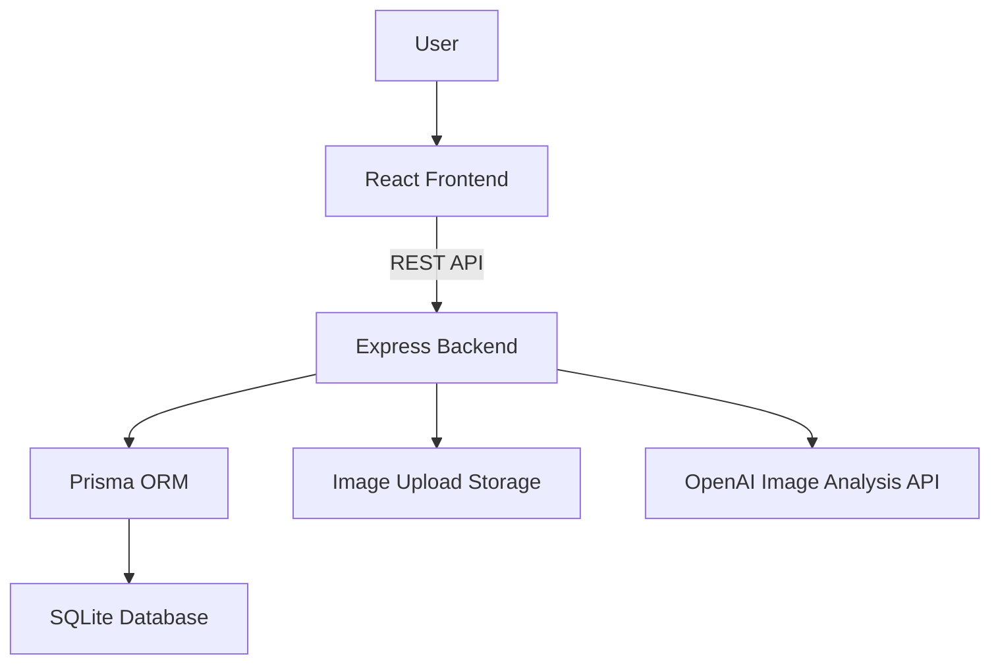

# Match Catch

**이미지 기반 분실물·습득물 매칭 플랫폼**

Match Catch는 충남대학교 학생들이 교내 분실물과 습득물을 더 쉽게 연결할 수 있도록 만든 웹앱 기반 분실물 매칭 시스템입니다.
습득자는 사진 한 장으로 습득물을 등록하고, 시스템은 이미지에서 특징 키워드를 추출합니다. 분실자는 분실물 정보와 키워드를 기반으로 유사한 습득물을 조회하고, 매칭 요청·채팅·인도 완료·후기 작성 흐름을 통해 분실물 반환 과정을 진행할 수 있습니다.

---

## 프로젝트 개요

기존 충남대학교 분실물광장은 습득물 등록 과정이 번거롭고, 분실자가 등록된 습득물을 탐색하기 어렵다는 문제가 있었습니다.

주요 문제는 다음과 같습니다.

* 습득물 등록을 위해 포털 로그인 및 여러 필수 항목 입력이 필요함
* 사진이 미리보기로 제공되지 않아 분실자가 직접 게시글을 확인해야 함
* 검색 기준이 제한적이어서 본문, 장소, 시간, 특징 기반 탐색이 어려움
* 분실물 처리 방식이 건물별 행정실, 게시판, 커뮤니티 등으로 분산되어 있음

Match Catch는 이러한 문제를 해결하기 위해 **이미지 기반 키워드 추출**, **유사 습득물 조회**, **매칭 요청**, **채팅**, **인도 완료 및 후기 시스템**을 제공하는 분실물 매칭 플랫폼으로 설계되었습니다.

---

## Team Role

본 프로젝트는 전체 기획 및 검증은 팀 단위로 진행되었으며,  
최종 프로토타입의 주요 구현은 Frontend, Backend, AI 역할로 나누어 진행했습니다.

| 역할 | 담당 |
|---|---|
| Frontend | 임유정 |
| Backend / DB / API | 이의준 |
| AI / Image Analysis | 김민수 |

### 이의준 Role

**Backend / Database / API 구현 담당**

### My Contributions

* Node.js / Express 기반 백엔드 REST API 구현
* Prisma ORM과 SQLite 기반 데이터베이스 설계 및 연동
* JWT 기반 인증 및 권한 검증 미들웨어 구현
* 학번 기반 회원가입 및 로그인 기능 구현
* 분실물 / 습득물 등록, 조회, 수정 API 구현
* Multer 기반 이미지 업로드 및 파일 검증 처리
* OpenAI API 기반 이미지 특징 키워드 분석 기능 연동
* 키워드 기반 유사 습득물 조회 기능 구현
* 매칭 요청 / 수락 / 거절 / 인도 완료 상태 관리 구현
* 매칭 수락 시 채팅방 생성 및 메시지 송수신 API 구현
* 후기 작성 및 사용자 온도 변경 로직 구현
* 활동 내역 저장 및 조회 기능 구현
* 상태 전이, 중복 요청, 권한 없는 접근에 대한 예외 처리 구현

---

## 주요 기능

### 1. 회원 및 인증

* 학번 기반 회원가입
* 로그인
* 비밀번호 bcrypt 암호화 저장
* JWT Access Token 발급
* 인증 필요 API에 대한 토큰 검증
* 사용자 프로필 조회 및 수정
* 활동 내역 조회
* 사용자 온도 조회

---

### 2. 분실물 관리

* 분실물 등록
* 분실물 목록 조회
* 분실물 상세 조회
* 분실물 수정
* 분실 장소, 분실 시간, 설명, 이미지 정보 저장
* 분실물 상태 관리

---

### 3. 습득물 관리

* 습득물 등록
* 습득물 목록 조회
* 습득물 상세 조회
* 습득물 수정
* 이미지 업로드 및 저장
* 습득 장소, 습득 시간, 설명 정보 저장
* 습득물 상태 관리

---

### 4. AI 이미지 분석

* 업로드된 이미지 기반 특징 키워드 추출
* OpenAI API를 활용한 이미지 분석
* 물건명, 일반 키워드, 고유 특징 키워드 추출
* 분석 결과를 DB에 저장하여 유사도 비교에 활용
* AI 분석 실패 시에도 기본 등록 흐름 유지

---

### 5. 유사 습득물 조회

* 분실물 정보와 습득물 키워드 비교
* 키워드 기반 유사도 계산
* 유사도 높은 습득물 목록 정렬
* 분실자가 자신의 물건으로 추정되는 습득물 확인 가능

---

### 6. 매칭 시스템

* 분실자가 습득물에 매칭 요청
* 습득자가 매칭 요청 수락 또는 거절
* 매칭 상태 기반 관리
* 중복 매칭 요청 방지
* 매칭 수락 시 분실물과 습득물 상태 변경
* 매칭 수락 시 채팅방 자동 생성
* 인도 완료 처리

---

### 7. 채팅 및 후기

* 매칭이 수락된 사용자 간 채팅방 생성
* 거래 당사자만 채팅방 접근 가능
* 메시지 전송 및 조회
* 인도 완료 후 후기 작성
* 긍정 / 부정 후기에 따른 사용자 온도 변경
* 활동 내역 기록

---

## 구현 범위

### 구현 완료

* 회원가입 / 로그인
* JWT 인증
* 프로필 조회 / 수정
* 활동 내역 조회
* 온도 조회
* 분실물 등록 / 조회 / 수정
* 습득물 등록 / 조회 / 수정
* 이미지 업로드
* OpenAI 기반 이미지 특징 분석
* 유사 습득물 조회
* 매칭 요청
* 매칭 수락
* 매칭 거절
* 매칭 목록 및 상태 조회
* 인도 완료 처리
* 채팅방 생성
* 메시지 전송 / 조회
* 후기 작성
* 사용자 온도 변경

### 향후 확장 예정

* WebSocket 기반 실시간 채팅
* 실시간 알림
* 관리자 기능
* 신고 및 제재 기능
* 지도 기반 위치 표시
* 이미지 임베딩 기반 고도화된 유사도 분석
* 배포 환경 구성

---

## 기술 스택

| 구분              | 기술                                          |
| --------------- | ------------------------------------------- |
| Frontend        | React, Vite, React Router DOM, Tailwind CSS |
| Backend         | Node.js, Express                            |
| Database        | SQLite, Prisma ORM                          |
| Authentication  | JWT, bcrypt                                 |
| Image Upload    | Multer                                      |
| AI Integration  | OpenAI API                                  |
| API Test        | Postman                                     |
| Version Control | Git, GitHub                                 |

---

## 시스템 아키텍처



프론트엔드는 사용자 입력, 화면 전환, 이미지 등록 흐름을 담당합니다.
백엔드는 인증, 권한 검증, 이미지 업로드, AI 분석 연동, 데이터베이스 저장, 상태 전이, 매칭 및 채팅 로직을 담당합니다.

---

## 핵심 서비스 흐름

```text
회원가입 / 로그인
→ 습득물 등록
→ 이미지 업로드
→ AI 특징 키워드 추출
→ 분실물 등록
→ 유사 습득물 조회
→ 매칭 요청
→ 매칭 수락 / 거절
→ 채팅방 생성
→ 메시지 송수신
→ 인도 완료
→ 후기 작성
→ 사용자 온도 반영
```

---

## 주요 백엔드 구현 내용

### JWT 인증 및 권한 검증

로그인 성공 시 JWT를 발급하고, 인증이 필요한 API 요청에서는 토큰을 검증하여 사용자 정보를 식별합니다.
분실물, 습득물, 매칭, 채팅, 후기 기능에서는 본인 여부와 거래 당사자 여부를 검증하여 권한 없는 접근을 차단했습니다.

---

### 이미지 업로드 처리

Multer를 사용하여 이미지 파일 업로드를 처리했습니다.
업로드된 이미지는 서버에 저장되고, 이미지 경로는 데이터베이스에 저장됩니다.
파일 형식과 용량 검증을 통해 잘못된 파일 업로드를 방지했습니다.

---

### OpenAI 기반 이미지 특징 분석

이미지를 base64 또는 서버 저장 파일 경로 형태로 입력받아 OpenAI API에 분석을 요청합니다.
응답 결과는 JSON 형태로 파싱하고, 물건명·일반 키워드·고유 특징 키워드 등으로 정규화하여 저장합니다.
AI 분석 결과는 분실물과 습득물 간 유사도 비교에 활용됩니다.

---

### 키워드 기반 유사도 비교

분실물의 특징 키워드와 습득물의 AI 추출 키워드를 비교하여 유사도 점수를 계산합니다.
분실자는 유사도 점수가 높은 순서로 습득물 후보를 확인할 수 있습니다.

---

### 상태 기반 매칭 로직

매칭 기능은 상태 기반으로 관리됩니다.

| 상태        | 설명       |
| --------- | -------- |
| PENDING   | 매칭 요청 대기 |
| ACCEPTED  | 매칭 요청 수락 |
| REJECTED  | 매칭 요청 거절 |
| DELIVERED | 인도 완료    |

서버는 정의된 상태 전이만 허용하며, 이미 종료된 매칭이나 잘못된 상태 변경 요청은 차단합니다.

---

### 채팅 및 거래 완료 흐름

매칭 요청이 수락되면 채팅방이 생성됩니다.
거래 당사자는 채팅을 통해 물건 전달 장소와 시간을 조율할 수 있습니다.
물건 전달이 완료되면 인도 완료 처리를 수행하고, 이후 후기 작성 및 사용자 온도 반영이 가능합니다.

---

## 데이터베이스 구조 요약

주요 테이블은 다음과 같습니다.

| 테이블           | 설명                        |
| ------------- | ------------------------- |
| users         | 사용자 계정, 학번, 비밀번호, 온도 정보   |
| lost_items    | 분실물 정보                    |
| found_items   | 습득물 정보                    |
| item_keywords | 이미지 분석 및 사용자 입력 기반 특징 키워드 |
| matches       | 분실물과 습득물 간 매칭 요청 상태       |
| chat_rooms    | 매칭 수락 후 생성되는 채팅방          |
| messages      | 채팅 메시지                    |
| reviews       | 인도 완료 후 작성되는 후기           |
| activities    | 사용자 활동 내역                 |

### 주요 관계

* 한 명의 사용자는 여러 개의 분실물 또는 습득물을 등록할 수 있습니다.
* 분실물과 습득물은 matches 테이블을 통해 연결됩니다.
* 매칭이 수락되면 하나의 채팅방이 생성됩니다.
* 채팅방은 여러 개의 메시지를 가질 수 있습니다.
* 후기는 매칭 및 사용자 정보와 연결됩니다.
* 활동 내역은 사용자와 주요 거래 이벤트를 기록합니다.

---

## API 요약

### Auth

| Method | Endpoint             | 설명           |
| ------ | -------------------- | ------------ |
| POST   | `/api/auth/register` | 회원가입         |
| POST   | `/api/auth/login`    | 로그인 및 JWT 발급 |

### Profile

| Method | Endpoint                      | 설명         |
| ------ | ----------------------------- | ---------- |
| GET    | `/api/profile/me`             | 내 프로필 조회   |
| PATCH  | `/api/profile/me`             | 내 프로필 수정   |
| GET    | `/api/profile/me/activities`  | 내 활동 내역 조회 |
| GET    | `/api/profile/me/temperature` | 내 온도 조회    |

### Lost Items

| Method | Endpoint                                            | 설명        |
| ------ | --------------------------------------------------- | --------- |
| POST   | `/api/lost-items`                                   | 분실물 등록    |
| GET    | `/api/lost-items`                                   | 분실물 목록 조회 |
| GET    | `/api/lost-items/:lost_item_id`                     | 분실물 상세 조회 |
| PATCH  | `/api/lost-items/:lost_item_id`                     | 분실물 수정    |
| GET    | `/api/lost-items/:lost_item_id/similar-found-items` | 유사 습득물 조회 |

### Found Items

| Method | Endpoint                          | 설명        |
| ------ | --------------------------------- | --------- |
| POST   | `/api/found-items`                | 습득물 등록    |
| GET    | `/api/found-items`                | 습득물 목록 조회 |
| GET    | `/api/found-items/:found_item_id` | 습득물 상세 조회 |
| PATCH  | `/api/found-items/:found_item_id` | 습득물 수정    |

### AI

| Method | Endpoint          | 설명               |
| ------ | ----------------- | ---------------- |
| POST   | `/api/ai/analyze` | 이미지 기반 특징 키워드 분석 |

### Matches

| Method | Endpoint                         | 설명       |
| ------ | -------------------------------- | -------- |
| POST   | `/api/matches`                   | 매칭 요청    |
| GET    | `/api/matches`                   | 매칭 목록 조회 |
| GET    | `/api/matches/:match_id`         | 매칭 상세 조회 |
| PATCH  | `/api/matches/:match_id/accept`  | 매칭 수락    |
| PATCH  | `/api/matches/:match_id/reject`  | 매칭 거절    |
| PATCH  | `/api/matches/:match_id/deliver` | 인도 완료 처리 |

### Chat

| Method | Endpoint                                 | 설명        |
| ------ | ---------------------------------------- | --------- |
| POST   | `/api/chat-rooms/:chat_room_id/messages` | 메시지 전송    |
| GET    | `/api/chat-rooms/:chat_room_id/messages` | 메시지 목록 조회 |

### Review

| Method | Endpoint       | 설명            |
| ------ | -------------- | ------------- |
| POST   | `/api/reviews` | 후기 작성 및 온도 반영 |

---

## 사용자 검증

프로젝트는 Figma 기반 초기 프로토타입에서 출발하여, 최종적으로 풀스택 웹앱 형태의 프로토타입으로 발전했습니다.

최종 사용자 검증은 1·2차 검증에 참여하지 않은 72명을 대상으로 진행했습니다.
검증 항목은 다음과 같습니다.

* 분실자 정보 활용
* 이미지 기반 키워드 생성
* 분실자·습득자 매칭
* 전반적 만족도
* 사용 가치

검증 결과, 이미지 기반 키워드 생성과 분실자 정보 활용 등 핵심 기능에 대해서는 긍정적인 평가가 많았습니다.
다만 실사용 가치와 전반적 만족도 측면에서는 개선 여지가 확인되었고, 이는 향후 사용자 유입 전략과 기능 고도화의 필요성으로 정리했습니다.

---

## 프로젝트 구조

```text
match_catch
├── backend
│   ├── src
│   │   ├── controllers
│   │   ├── services
│   │   ├── routes
│   │   ├── middlewares
│   │   └── app.js / server.js
│   ├── prisma
│   │   └── schema.prisma
│   ├── uploads
│   ├── package.json
│   └── .env.example
│
├── frontend
│   ├── src
│   │   ├── pages
│   │   ├── components
│   │   ├── api
│   │   └── assets
│   ├── package.json
│   └── vite.config.js
│
├── docs
│   ├── FUNCTION_SPEC.md
│   ├── API.md
│   ├── DB.md
│   ├── DESIGN.md
│   └── TEST.md
│
└── README.md
```

---

## Documents

| 문서                                              | 설명                                  |
| ----------------------------------------------- | ----------------------------------- |
| [Function Specification](docs/FUNCTION_SPEC.md) | 전체 기능 요구사항, 사용자 역할, 상태 전이, 예외 처리 기준 |
| [API Specification](docs/API.md)                | 실제 구현 API의 요청/응답 명세                 |
| [Database Design](docs/DB.md)                   | 데이터베이스 테이블, 관계, 제약 조건               |
| [Design](docs/DESIGN.md)                        | 시스템 아키텍처 및 주요 설계 의사결정               |

---

## 실행 방법

### 1. Backend

```bash
cd backend
npm install
npx prisma generate
npx prisma migrate dev
npm run dev
```

`.env.example` 파일을 참고하여 `.env` 파일을 생성해야 합니다.

예시:

```env
DATABASE_URL="file:./dev.db"
JWT_SECRET="your-jwt-secret"
OPENAI_API_KEY="your-openai-api-key"
```

---

### 2. Frontend

```bash
cd frontend
npm install
npm run dev
```

---

## 문제 해결 및 개선 사항

* 프론트엔드와 기능명세서에는 존재하지만 백엔드에 누락되어 있던 일부 API를 추가 구현했습니다.
* 매칭 거절 API를 추가하여 `PENDING → REJECTED` 상태 전이를 처리했습니다.
* 프로필 수정 및 온도 조회 API를 추가하여 사용자 정보 관리 기능을 보완했습니다.
* 분실물 / 습득물 수정 API를 추가하고, 매칭 진행 중이거나 인도 완료된 데이터는 수정할 수 없도록 제한했습니다.
* 매칭 수락, 인도 완료, 후기 작성처럼 여러 테이블이 함께 변경되는 기능에는 트랜잭션 처리를 적용하여 데이터 무결성을 보장했습니다.
* 거래 당사자만 채팅방에 접근할 수 있도록 권한 검증을 적용했습니다.
* AI 분석 실패 시에도 기본 등록 흐름이 유지되도록 예외 처리 정책을 설계했습니다.

---

## 기대 효과

* 습득자는 사진 기반 등록을 통해 분실물 신고 과정의 부담을 줄일 수 있습니다.
* 분실자는 키워드 기반 유사도 조회를 통해 자신의 물건으로 추정되는 습득물을 빠르게 찾을 수 있습니다.
* 분실물 관리 담당자의 반복적인 확인 업무를 줄일 수 있습니다.
* 활동 내역과 후기, 온도 시스템을 통해 사칭 및 부정 이용을 완화할 수 있습니다.

---

## Future Work

* WebSocket 기반 실시간 채팅
* 실시간 알림 기능
* 관리자 페이지 및 신고 처리 기능
* 지도 기반 위치 표시
* 이미지 임베딩 기반 고도화된 유사도 분석
* 학교 포털 또는 학내 인증 시스템 연동
* 배포 환경 구성

---

## Demo

* 시연 영상: https://youtube.com/shorts/SxnvnUH2jQo?feature=share

---

## Repository

* GitHub: https://github.com/HowToCom/match_catch
