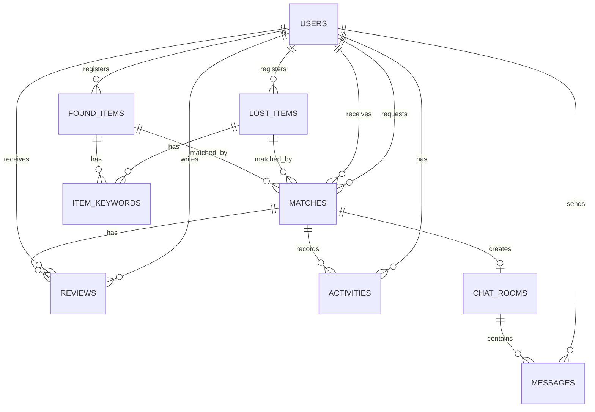

# Database Design

Match Catch 데이터베이스 설계 문서입니다.
본 문서는 Prisma ORM과 SQLite를 기반으로 구성된 주요 테이블, 관계, 상태값, 데이터 무결성 정책을 정리합니다.

---

## 1. Database Overview

Match Catch는 분실물과 습득물을 연결하는 매칭 서비스를 제공하기 위해 관계형 데이터베이스 구조를 사용합니다.

데이터베이스는 다음 정보를 중심으로 구성됩니다.

* 사용자 계정 및 신뢰도 정보
* 분실물 정보
* 습득물 정보
* 이미지 분석 기반 특징 키워드
* 분실물과 습득물 간 매칭 요청
* 매칭 수락 후 생성되는 채팅방
* 채팅 메시지
* 인도 완료 후 후기
* 사용자 활동 내역

본 프로젝트는 개발 및 프로토타입 환경에서의 간단한 실행과 관리를 위해 SQLite를 사용하고, 데이터 접근 및 관계 관리는 Prisma ORM을 통해 처리합니다.

---

## 2. Technology

| 구분                | 기술                    |
| ----------------- | --------------------- |
| Database          | SQLite                |
| ORM               | Prisma                |
| Data Access       | Prisma Client         |
| Schema Management | Prisma Schema         |
| Transaction       | Prisma `$transaction` |

---

## 3. ERD



---

## 4. Main Tables

## 4.1 users

사용자 계정 정보를 저장하는 테이블입니다.
회원가입, 로그인, 프로필 조회, 온도 관리, 활동 내역 연결의 기준이 됩니다.

### 주요 필드

| 필드           | 타입       | 설명                |
| ------------ | -------- | ----------------- |
| id           | Int      | 사용자 고유 ID         |
| studentId    | String   | 학번                |
| username     | String   | 사용자 아이디           |
| passwordHash | String   | bcrypt로 암호화된 비밀번호 |
| temperature  | Float    | 사용자 신뢰도 온도        |
| createdAt    | DateTime | 생성 시각             |
| updatedAt    | DateTime | 수정 시각             |

### 제약 조건

* `studentId`는 중복될 수 없습니다.
* `username`은 중복될 수 없습니다.
* 비밀번호는 평문으로 저장하지 않고 bcrypt 해시값으로 저장합니다.
* 기본 온도는 회원가입 시 초기값으로 설정합니다.

### 사용 기능

* 회원가입
* 로그인
* 프로필 조회
* 프로필 수정
* 온도 조회
* 후기 작성 시 온도 변경
* 활동 내역 조회

---

## 4.2 lost_items

분실자가 등록한 분실물 정보를 저장하는 테이블입니다.

### 주요 필드

| 필드           | 타입       | 설명            |
| ------------ | -------- | ------------- |
| id           | Int      | 분실물 고유 ID     |
| ownerId      | Int      | 분실물 등록자 ID    |
| title        | String   | 분실물 제목        |
| description  | String   | 분실물 설명        |
| imageUrl     | String   | 분실물 참고 이미지 경로 |
| lostLocation | String   | 분실 장소         |
| lostTime     | DateTime | 분실 시간         |
| status       | String   | 분실물 상태        |
| createdAt    | DateTime | 생성 시각         |
| updatedAt    | DateTime | 수정 시각         |

### 상태값

| 상태              | 설명              |
| --------------- | --------------- |
| REGISTERED      | 분실물 등록 완료       |
| MATCH_REQUESTED | 매칭 요청 진행 중      |
| MATCHING        | 매칭 수락 후 거래 진행 중 |
| DELIVERED       | 인도 완료           |

### 제약 조건 및 정책

* 한 명의 사용자는 여러 개의 분실물을 등록할 수 있습니다.
* 분실물은 등록자인 사용자와 연결됩니다.
* 분실물 수정은 등록자 본인만 가능합니다.
* `REGISTERED` 상태의 분실물만 수정할 수 있습니다.
* 매칭 요청 생성 시 `REGISTERED → MATCH_REQUESTED`로 상태가 변경됩니다.
* 매칭 수락 시 `MATCH_REQUESTED → MATCHING`으로 상태가 변경됩니다.
* 인도 완료 시 `MATCHING → DELIVERED`로 상태가 변경됩니다.

### 사용 기능

* 분실물 등록
* 분실물 목록 조회
* 분실물 상세 조회
* 분실물 수정
* 유사 습득물 조회
* 매칭 요청
* 인도 완료

---

## 4.3 found_items

습득자가 등록한 습득물 정보를 저장하는 테이블입니다.

### 주요 필드

| 필드            | 타입       | 설명         |
| ------------- | -------- | ---------- |
| id            | Int      | 습득물 고유 ID  |
| ownerId       | Int      | 습득물 등록자 ID |
| imageUrl      | String   | 습득물 이미지 경로 |
| description   | String   | 습득물 설명     |
| foundLocation | String   | 습득 장소      |
| foundTime     | DateTime | 습득 시간      |
| status        | String   | 습득물 상태     |
| aiStatus      | String   | AI 분석 상태   |
| createdAt     | DateTime | 생성 시각      |
| updatedAt     | DateTime | 수정 시각      |

### 상태값

| 상태         | 설명              |
| ---------- | --------------- |
| REGISTERED | 습득물 등록 완료       |
| MATCHING   | 매칭 수락 후 거래 진행 중 |
| DELIVERED  | 인도 완료           |

### AI 분석 상태값

| 상태      | 설명              |
| ------- | --------------- |
| PENDING | 분석 대기 또는 재분석 필요 |
| SUCCESS | AI 분석 성공        |
| FAILED  | AI 분석 실패        |

### 제약 조건 및 정책

* 한 명의 사용자는 여러 개의 습득물을 등록할 수 있습니다.
* 습득물은 등록자인 사용자와 연결됩니다.
* 습득물 등록 시 이미지는 필수입니다.
* 습득물 수정은 등록자 본인만 가능합니다.
* `REGISTERED` 상태의 습득물만 수정할 수 있습니다.
* 매칭 수락 시 `REGISTERED → MATCHING`으로 상태가 변경됩니다.
* 인도 완료 시 `MATCHING → DELIVERED`로 상태가 변경됩니다.
* AI 분석에 실패해도 습득물 등록 자체는 유지될 수 있습니다.

### 사용 기능

* 습득물 등록
* 습득물 목록 조회
* 습득물 상세 조회
* 습득물 수정
* 이미지 기반 키워드 추출
* 유사 습득물 조회
* 매칭 수락
* 인도 완료

---

## 4.4 item_keywords

분실물 또는 습득물에 연결되는 특징 키워드를 저장하는 테이블입니다.

분실물의 경우 사용자가 입력한 키워드 또는 이미지 분석 결과를 저장할 수 있고, 습득물의 경우 이미지 분석 결과로 추출된 키워드를 저장합니다.

### 주요 필드

| 필드        | 타입       | 설명            |
| --------- | -------- | ------------- |
| id        | Int      | 키워드 고유 ID     |
| ownerType | String   | 키워드 소유 대상 유형  |
| ownerId   | Int      | 분실물 또는 습득물 ID |
| keyword   | String   | 특징 키워드        |
| createdAt | DateTime | 생성 시각         |

### ownerType 값

| 값     | 설명      |
| ----- | ------- |
| LOST  | 분실물 키워드 |
| FOUND | 습득물 키워드 |

### 설계 이유

분실물과 습득물 모두 키워드를 가질 수 있지만, 키워드의 구조는 동일합니다.
따라서 별도의 테이블로 분리하고 `ownerType`, `ownerId`를 통해 분실물 또는 습득물과 연결합니다.

### 사용 기능

* AI 이미지 분석 결과 저장
* 분실물 특징 키워드 저장
* 습득물 특징 키워드 저장
* 유사도 계산
* 유사 습득물 조회

---

## 4.5 matches

분실물과 습득물 간의 매칭 요청 정보를 저장하는 테이블입니다.

### 주요 필드

| 필드          | 타입       | 설명        |
| ----------- | -------- | --------- |
| id          | Int      | 매칭 고유 ID  |
| lostItemId  | Int      | 분실물 ID    |
| foundItemId | Int      | 습득물 ID    |
| requesterId | Int      | 매칭 요청자 ID |
| receiverId  | Int      | 매칭 수신자 ID |
| status      | String   | 매칭 상태     |
| createdAt   | DateTime | 생성 시각     |
| updatedAt   | DateTime | 수정 시각     |

### 상태값

| 상태        | 설명       |
| --------- | -------- |
| PENDING   | 매칭 요청 대기 |
| ACCEPTED  | 매칭 요청 수락 |
| REJECTED  | 매칭 요청 거절 |
| DELIVERED | 인도 완료    |

### 제약 조건 및 정책

* 분실물 등록자만 매칭 요청을 생성할 수 있습니다.
* 습득물 등록자가 매칭 요청을 수락하거나 거절할 수 있습니다.
* 본인이 등록한 습득물에는 매칭 요청을 보낼 수 없습니다.
* 동일한 분실물에 대해 진행 중인 매칭 요청은 제한됩니다.
* 이미 종료된 매칭은 다시 활성화하지 않습니다.
* 매칭 수락 시 채팅방이 생성됩니다.
* 인도 완료 시 관련 분실물, 습득물, 매칭 상태가 함께 변경됩니다.

### 상태 전이

```text
PENDING → ACCEPTED → DELIVERED
        └→ REJECTED
```

### 사용 기능

* 매칭 요청
* 매칭 수락
* 매칭 거절
* 매칭 목록 조회
* 매칭 상세 조회
* 인도 완료
* 채팅방 생성
* 후기 작성

---

## 4.6 chat_rooms

매칭 수락 후 생성되는 채팅방 정보를 저장하는 테이블입니다.

### 주요 필드

| 필드        | 타입       | 설명        |
| --------- | -------- | --------- |
| id        | Int      | 채팅방 고유 ID |
| matchId   | Int      | 연결된 매칭 ID |
| createdAt | DateTime | 생성 시각     |
| updatedAt | DateTime | 수정 시각     |

### 제약 조건 및 정책

* 채팅방은 매칭이 `ACCEPTED` 상태가 되었을 때 생성됩니다.
* 하나의 매칭은 하나의 채팅방과 연결됩니다.
* 채팅방 접근은 해당 매칭의 거래 당사자만 가능합니다.
* 매칭과 관련 없는 사용자는 채팅방에 접근할 수 없습니다.

### 사용 기능

* 매칭 수락 시 채팅방 생성
* 메시지 전송
* 메시지 조회

---

## 4.7 messages

채팅방에서 송수신되는 메시지를 저장하는 테이블입니다.

### 주요 필드

| 필드         | 타입       | 설명         |
| ---------- | -------- | ---------- |
| id         | Int      | 메시지 고유 ID  |
| chatRoomId | Int      | 채팅방 ID     |
| senderId   | Int      | 메시지 발신자 ID |
| message    | String   | 메시지 내용     |
| createdAt  | DateTime | 생성 시각      |

### 제약 조건 및 정책

* 메시지는 특정 채팅방에 속합니다.
* 메시지 발신자는 사용자 테이블과 연결됩니다.
* 채팅방 참여자만 메시지를 전송할 수 있습니다.
* 채팅방 참여자만 메시지 목록을 조회할 수 있습니다.
* 빈 메시지는 저장하지 않습니다.

### 사용 기능

* 메시지 전송
* 메시지 목록 조회
* 채팅 내역 확인

---

## 4.8 reviews

거래 완료 후 작성되는 후기를 저장하는 테이블입니다.

### 주요 필드

| 필드           | 타입       | 설명           |
| ------------ | -------- | ------------ |
| id           | Int      | 후기 고유 ID     |
| matchId      | Int      | 후기 대상 매칭 ID  |
| writerId     | Int      | 후기 작성자 ID    |
| targetUserId | Int      | 후기 대상 사용자 ID |
| reviewType   | String   | 후기 유형        |
| content      | String   | 후기 내용        |
| createdAt    | DateTime | 생성 시각        |

### 후기 유형

| 값        | 설명    |
| -------- | ----- |
| POSITIVE | 긍정 후기 |
| NEGATIVE | 부정 후기 |

### 제약 조건 및 정책

* 후기는 매칭 상태가 `DELIVERED`일 때만 작성할 수 있습니다.
* 거래 당사자만 후기를 작성할 수 있습니다.
* 자기 자신에게 후기를 작성할 수 없습니다.
* 한 사용자는 하나의 매칭에 대해 한 번만 후기를 작성할 수 있습니다.
* 후기 작성 시 대상 사용자의 온도가 변경됩니다.

### 온도 변경 정책

| 후기 유형    | 온도 변화 |
| -------- | ----: |
| POSITIVE |    +5 |
| NEGATIVE |    -5 |

### 사용 기능

* 후기 작성
* 중복 후기 검증
* 사용자 온도 변경

---

## 4.9 activities

사용자의 주요 활동 내역을 저장하는 테이블입니다.

### 주요 필드

| 필드           | 타입       | 설명       |
| ------------ | -------- | -------- |
| id           | Int      | 활동 고유 ID |
| userId       | Int      | 사용자 ID   |
| matchId      | Int      | 관련 매칭 ID |
| activityType | String   | 활동 유형    |
| description  | String   | 활동 설명    |
| createdAt    | DateTime | 생성 시각    |

### 활동 유형 예시

| 값                  | 설명       |
| ------------------ | -------- |
| MATCH_CREATED      | 매칭 요청 생성 |
| MATCH_ACCEPTED     | 매칭 요청 수락 |
| MATCH_REJECTED     | 매칭 요청 거절 |
| DELIVERY_COMPLETED | 인도 완료    |
| REVIEW_CREATED     | 후기 작성    |

### 제약 조건 및 정책

* 주요 거래 이벤트 발생 시 활동 내역을 저장합니다.
* 사용자는 자신의 활동 내역만 조회할 수 있습니다.
* 인도 완료, 후기 작성 등 거래 흐름을 추적하는 데 사용됩니다.

### 사용 기능

* 활동 내역 저장
* 내 활동 내역 조회
* 사용자 프로필 내 거래 이력 확인

---

## 5. Table Relationships

## 5.1 User 중심 관계

| 관계                      | 설명                                    |
| ----------------------- | ------------------------------------- |
| users 1 : N lost_items  | 한 사용자는 여러 개의 분실물을 등록할 수 있습니다.         |
| users 1 : N found_items | 한 사용자는 여러 개의 습득물을 등록할 수 있습니다.         |
| users 1 : N matches     | 한 사용자는 여러 개의 매칭 요청자 또는 수신자가 될 수 있습니다. |
| users 1 : N messages    | 한 사용자는 여러 개의 메시지를 보낼 수 있습니다.          |
| users 1 : N reviews     | 한 사용자는 여러 개의 후기를 작성하거나 받을 수 있습니다.     |
| users 1 : N activities  | 한 사용자는 여러 개의 활동 내역을 가질 수 있습니다.        |

---

## 5.2 Item 중심 관계

| 관계                              | 설명                                |
| ------------------------------- | --------------------------------- |
| lost_items 1 : N item_keywords  | 하나의 분실물은 여러 개의 특징 키워드를 가질 수 있습니다. |
| found_items 1 : N item_keywords | 하나의 습득물은 여러 개의 특징 키워드를 가질 수 있습니다. |
| lost_items 1 : N matches        | 하나의 분실물은 여러 매칭 기록과 연결될 수 있습니다.    |
| found_items 1 : N matches       | 하나의 습득물은 여러 매칭 기록과 연결될 수 있습니다.    |

---

## 5.3 Match 중심 관계

| 관계                          | 설명                                 |
| --------------------------- | ---------------------------------- |
| matches 1 : 0..1 chat_rooms | 매칭이 수락되면 하나의 채팅방이 생성됩니다.           |
| chat_rooms 1 : N messages   | 하나의 채팅방은 여러 메시지를 포함합니다.            |
| matches 1 : N reviews       | 하나의 매칭에 대해 거래 당사자가 후기를 작성할 수 있습니다. |
| matches 1 : N activities    | 매칭 관련 이벤트는 활동 내역으로 기록될 수 있습니다.     |

---

## 6. Status Transition Rules

## 6.1 Lost Item 상태 전이

```text
REGISTERED → MATCH_REQUESTED → MATCHING → DELIVERED
```

| 현재 상태           | 변경 가능 상태        | 발생 조건    |
| --------------- | --------------- | -------- |
| REGISTERED      | MATCH_REQUESTED | 매칭 요청 생성 |
| MATCH_REQUESTED | MATCHING        | 매칭 요청 수락 |
| MATCH_REQUESTED | REGISTERED      | 매칭 요청 거절 |
| MATCHING        | DELIVERED       | 인도 완료    |
| DELIVERED       | 변경 불가           | 최종 상태    |

---

## 6.2 Found Item 상태 전이

```text
REGISTERED → MATCHING → DELIVERED
```

| 현재 상태      | 변경 가능 상태  | 발생 조건    |
| ---------- | --------- | -------- |
| REGISTERED | MATCHING  | 매칭 요청 수락 |
| MATCHING   | DELIVERED | 인도 완료    |
| DELIVERED  | 변경 불가     | 최종 상태    |

---

## 6.3 Match 상태 전이

```text
PENDING → ACCEPTED → DELIVERED
        └→ REJECTED
```

| 현재 상태     | 변경 가능 상태  | 발생 조건            |
| --------- | --------- | ---------------- |
| PENDING   | ACCEPTED  | 습득자가 매칭 요청 수락    |
| PENDING   | REJECTED  | 습득자가 매칭 요청 거절    |
| ACCEPTED  | DELIVERED | 거래 당사자가 인도 완료 처리 |
| REJECTED  | 변경 불가     | 종료 상태            |
| DELIVERED | 변경 불가     | 최종 상태            |

---

## 7. Data Integrity Rules

데이터 무결성을 위해 다음 정책을 적용합니다.

### 7.1 인증 및 권한 검증

* 인증이 필요한 API는 JWT 토큰을 통해 사용자 정보를 확인합니다.
* 분실물 수정은 등록자 본인만 가능합니다.
* 습득물 수정은 등록자 본인만 가능합니다.
* 매칭 요청은 분실물 등록자만 생성할 수 있습니다.
* 매칭 수락 및 거절은 습득물 등록자만 처리할 수 있습니다.
* 채팅방 접근은 거래 당사자만 가능합니다.
* 후기 작성은 인도 완료된 매칭의 거래 당사자만 가능합니다.

---

### 7.2 중복 데이터 방지

* 중복 학번은 허용하지 않습니다.
* 중복 아이디는 허용하지 않습니다.
* 동일한 매칭에 대한 중복 후기는 제한합니다.
* 진행 중인 매칭에 대한 중복 요청은 제한합니다.
* 이미 종료된 매칭은 다시 활성화하지 않습니다.

---

### 7.3 상태 기반 변경 제한

* 클라이언트가 직접 분실물, 습득물, 매칭 상태를 변경하지 않습니다.
* 상태 변경은 서버 내부 비즈니스 로직을 통해서만 수행합니다.
* 정의된 상태 전이만 허용합니다.
* `DELIVERED` 상태의 데이터는 추가 상태 변경을 제한합니다.
* `MATCHING` 또는 `DELIVERED` 상태의 분실물과 습득물은 수정할 수 없습니다.

---

### 7.4 트랜잭션 처리

여러 테이블이 함께 변경되는 기능은 트랜잭션으로 처리합니다.

| 기능    | 함께 변경되는 데이터                                                       |
| ----- | ----------------------------------------------------------------- |
| 매칭 요청 | matches 생성, lost_items 상태 변경                                      |
| 매칭 수락 | matches 상태 변경, lost_items 상태 변경, found_items 상태 변경, chat_rooms 생성 |
| 매칭 거절 | matches 상태 변경, lost_items 상태 복구                                   |
| 인도 완료 | matches 상태 변경, lost_items 상태 변경, found_items 상태 변경, activities 생성 |
| 후기 작성 | reviews 생성, users 온도 변경                                           |

트랜잭션을 사용하여 일부 데이터만 변경되고 나머지가 실패하는 상황을 방지합니다.

---

## 8. Design Decisions

## 8.1 SQLite 사용 이유

본 프로젝트는 학기 프로젝트 및 MVP 성격의 프로토타입입니다.
따라서 별도 DB 서버 구축 없이 로컬 환경에서 빠르게 실행하고 검증할 수 있는 SQLite를 사용했습니다.

SQLite는 다음 장점이 있습니다.

* 별도 DB 서버 설치가 필요 없음
* 로컬 개발 환경 구성 간단
* Prisma와 쉽게 연동 가능
* 프로토타입 및 소규모 서비스 검증에 적합

---

## 8.2 Prisma ORM 사용 이유

Prisma ORM을 사용하여 데이터베이스 접근을 객체 중심으로 관리했습니다.

Prisma 사용 이유는 다음과 같습니다.

* JavaScript 코드에서 타입 기반 데이터 접근 가능
* 관계형 데이터 모델을 명확하게 표현 가능
* 복잡한 SQL 직접 작성 부담 감소
* 트랜잭션 처리 지원
* schema.prisma를 통해 DB 구조를 문서처럼 관리 가능

---

## 8.3 상태 기반 설계 이유

분실물 매칭 서비스는 단순 CRUD가 아니라 다음과 같은 흐름을 가집니다.

```text
등록 → 매칭 요청 → 수락 / 거절 → 채팅 → 인도 완료 → 후기
```

이 흐름을 안정적으로 관리하기 위해 분실물, 습득물, 매칭 각각에 상태값을 두었습니다.

상태값을 사용하면 다음 장점이 있습니다.

* 잘못된 상태 변경 방지
* 중복 매칭 요청 제한
* 매칭 수락 후에만 채팅 허용
* 인도 완료 후에만 후기 작성 허용
* 데이터 흐름을 명확하게 추적 가능

---

## 8.4 ItemKeywords 분리 이유

분실물과 습득물 모두 여러 개의 특징 키워드를 가질 수 있습니다.
키워드를 문자열 하나로 저장하면 검색과 유사도 계산이 어렵기 때문에 별도 테이블로 분리했습니다.

이를 통해 다음 작업을 쉽게 처리할 수 있습니다.

* 분실물 키워드 목록 조회
* 습득물 키워드 목록 조회
* 키워드 간 교집합 비교
* 유사도 점수 계산
* AI 분석 결과 저장

---

## 9. Future Improvements

향후 데이터베이스 구조는 다음 방향으로 확장할 수 있습니다.

* 이미지 파일 메타데이터 테이블 분리
* 신고 및 제재 테이블 추가
* 관리자 권한 테이블 추가
* 알림 테이블 추가
* 위치 기반 검색을 위한 좌표 필드 추가
* 이미지 임베딩 벡터 저장 구조 추가
* PostgreSQL 등 서버형 RDBMS로 전환
* 대용량 검색을 위한 인덱싱 최적화
