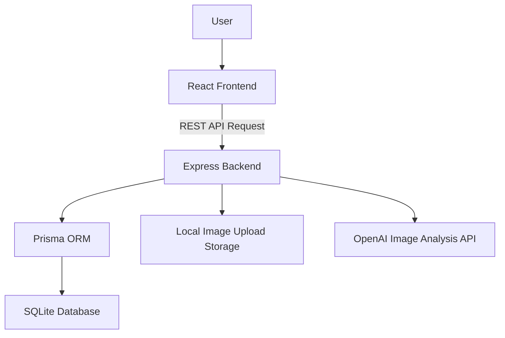

# Design Document

Match Catch 시스템 설계 문서입니다.
본 문서는 프로젝트의 시스템 구조, 주요 설계 의사결정, 백엔드 처리 흐름, 데이터 관리 방식, 인증 및 상태 관리 전략을 정리합니다.

---

## 1. Design Overview

Match Catch는 충남대학교 학생들이 분실물과 습득물을 더 쉽게 연결할 수 있도록 설계된 이미지 기반 분실물 매칭 플랫폼입니다.

기존 분실물 처리 방식은 다음과 같은 문제를 가지고 있었습니다.

* 습득물 등록 과정이 번거로움
* 분실자가 등록된 습득물을 직접 탐색해야 함
* 제목 중심 검색만 가능해 특징, 장소, 시간 기반 탐색이 어려움
* 게시글 확인과 사진 열람 과정에서 탐색 비용이 큼
* 분실자와 습득자가 직접 연결되는 구조가 부족함

이를 해결하기 위해 Match Catch는 다음 흐름을 중심으로 설계되었습니다.

```text
습득물 사진 등록
→ 이미지 기반 특징 키워드 추출
→ 분실물 정보 등록
→ 키워드 기반 유사 습득물 조회
→ 매칭 요청
→ 매칭 수락 / 거절
→ 채팅
→ 인도 완료
→ 후기 및 온도 반영
```

본 시스템의 핵심 설계 목표는 **습득자의 등록 부담을 줄이고**, **분실자의 탐색 비용을 낮추며**, **분실자와 습득자의 연결 과정을 상태 기반으로 안전하게 관리하는 것**입니다.

---

## 2. Design Goals

## 2.1 등록 과정 단순화

습득자가 여러 항목을 직접 입력하지 않아도 사진 기반으로 물건 정보를 일부 자동화할 수 있도록 설계했습니다.

이를 위해 다음 기능을 도입했습니다.

* 이미지 업로드
* AI 기반 이미지 특징 분석
* 물건명, 설명, 특징 키워드 추출
* 습득 장소와 시간 저장

---

## 2.2 탐색 비용 감소

분실자가 등록된 습득물을 직접 하나씩 확인하지 않아도 되도록, 분실물 정보와 습득물 특징 키워드를 비교하여 유사한 습득물을 우선적으로 보여주는 구조를 설계했습니다.

핵심 방식은 다음과 같습니다.

* 분실물 키워드 저장
* 습득물 AI 키워드 저장
* 키워드 교집합 기반 유사도 계산
* 유사도 높은 습득물 우선 정렬

---

## 2.3 안전한 매칭 흐름 관리

분실물 반환 과정은 단순 조회 기능이 아니라 다음 상태 흐름을 가집니다.

```text
등록
→ 매칭 요청
→ 수락 / 거절
→ 채팅
→ 인도 완료
→ 후기
```

따라서 시스템은 분실물, 습득물, 매칭 각각에 상태값을 두고, 허용된 상태 전이만 서버에서 처리하도록 설계했습니다.

---

## 2.4 역할과 권한 분리

분실자, 습득자, 거래 당사자는 수행할 수 있는 작업이 다릅니다.

예를 들어:

* 분실자는 자신의 분실물에 대해서만 매칭 요청 가능
* 습득자는 자신이 등록한 습득물에 들어온 요청만 수락 또는 거절 가능
* 매칭 당사자만 채팅방 접근 가능
* 인도 완료된 거래의 당사자만 후기 작성 가능

이러한 권한 검증은 클라이언트가 아니라 백엔드에서 수행하도록 설계했습니다.

---

## 3. System Architecture

Match Catch는 Frontend, Backend, Database, AI Analysis API로 구성됩니다.



### 구성 요소 역할

| 구성 요소           | 역할                                 |
| --------------- | ---------------------------------- |
| React Frontend  | 사용자 화면, 입력 처리, 화면 전환, API 호출       |
| Express Backend | REST API 제공, 인증, 권한 검증, 비즈니스 로직 처리 |
| Prisma ORM      | 데이터베이스 접근, 관계 관리, 트랜잭션 처리          |
| SQLite Database | 사용자, 분실물, 습득물, 매칭, 채팅, 후기 데이터 저장   |
| Upload Storage  | 업로드 이미지 파일 저장                      |
| OpenAI API      | 이미지 기반 물건 특징 키워드 분석                |

---

## 4. Frontend Design

## 4.1 Mobile-First SPA 구조

프론트엔드는 모바일 환경을 우선으로 고려한 단일 페이지 애플리케이션 형태로 설계했습니다.

주요 이유는 다음과 같습니다.

* 분실물과 습득물 등록은 모바일 사용 가능성이 높음
* 사진 촬영 및 업로드 흐름이 모바일 중심으로 발생함
* 앱처럼 자연스럽게 화면을 전환하는 경험이 필요함

프론트엔드는 React, Vite, React Router DOM, Tailwind CSS를 기반으로 구성했습니다.

---

## 4.2 관심사의 분리

프론트엔드는 화면을 구성하는 코드와 서버 통신 코드를 분리했습니다.

```text
화면 컴포넌트
→ API 서비스 계층
→ 백엔드 REST API
```

이 구조를 통해 화면 컴포넌트는 “무엇을 보여줄지”에 집중하고, API 서비스 계층은 “어떻게 서버와 통신할지”를 담당합니다.

### 설계 장점

* 화면 코드와 통신 코드의 결합도 감소
* API 경로 변경 시 수정 범위 축소
* 인증 헤더 처리 로직 재사용
* 서버 응답 정규화 로직을 한 곳에서 관리 가능

---

## 4.3 API 서비스 계층

프론트엔드 API 계층은 도메인별로 분리했습니다.

```text
api/
├── auth
├── item
├── match
├── profile
└── chat
```

각 도메인 API는 서버와의 통신, 응답 데이터 추출, 에러 메시지 변환을 담당합니다.

### 설계 원칙

* 도메인 단위 API 모듈 분리
* JWT 토큰 저장 및 인증 헤더 처리 캡슐화
* 서버 응답에서 실제 데이터만 추출
* 서버 오류를 사용자 친화적인 메시지로 변환
* 분실물과 습득물 응답 구조를 화면에서 쓰기 쉬운 형태로 정규화

---

## 4.4 이미지 기반 입력 자동화

사용자가 사진을 선택하면 프론트엔드는 다음 작업을 수행할 수 있도록 설계했습니다.

```text
이미지 선택
→ EXIF 메타데이터 추출
→ 촬영 시각 / 위치 정보 추출
→ 이미지 base64 인코딩
→ AI 분석 API 요청
→ 제목, 설명, 키워드 자동 입력
```

이미지 메타데이터 분석과 AI 분석은 서로 의존하지 않으므로 병렬로 처리할 수 있습니다.
이를 통해 사용자가 느끼는 대기 시간을 줄이고, 등록 양식을 자동으로 채우는 경험을 제공합니다.

---

## 5. Backend Design

## 5.1 Layered Architecture

백엔드는 Controller, Service, Route, Middleware 계층으로 분리했습니다.

```text
Route
→ Controller
→ Service
→ Prisma Client
→ Database
```

### 각 계층 역할

| 계층            | 역할                   |
| ------------- | -------------------- |
| Route         | URL 및 HTTP Method 매핑 |
| Controller    | 요청값 추출, 응답 형식 통일     |
| Service       | 핵심 비즈니스 로직 처리        |
| Middleware    | 인증, 파일 업로드, 에러 처리    |
| Prisma Client | 데이터베이스 접근            |

---

## 5.2 계층 분리 이유

백엔드 기능은 인증, 이미지 업로드, AI 분석, 매칭 상태 변경, 채팅, 후기 등으로 복잡도가 높습니다.
따라서 요청 처리와 비즈니스 로직을 분리하여 유지보수성을 높였습니다.

### 설계 장점

* Route는 API 경로 정의에만 집중
* Controller는 요청과 응답 처리에 집중
* Service는 실제 비즈니스 로직에 집중
* 인증과 파일 업로드는 Middleware로 공통 처리
* 기능 추가 시 영향 범위가 줄어듦

---

## 5.3 REST API 설계

백엔드는 REST API 형태로 기능을 제공합니다.

주요 도메인은 다음과 같이 분리했습니다.

| 도메인        | 예시 경로              |
| ---------- | ------------------ |
| Auth       | `/api/auth`        |
| Profile    | `/api/profile`     |
| Lost Item  | `/api/lost-items`  |
| Found Item | `/api/found-items` |
| AI         | `/api/ai`          |
| Match      | `/api/matches`     |
| Chat       | `/api/chat-rooms`  |
| Review     | `/api/reviews`     |

REST API는 자원 중심 URI와 HTTP Method를 기준으로 설계했습니다.

예시:

```text
POST /api/lost-items          분실물 등록
GET /api/lost-items           분실물 목록 조회
GET /api/lost-items/:id       분실물 상세 조회
PATCH /api/lost-items/:id     분실물 수정
```

---

## 6. Authentication & Authorization Design

## 6.1 JWT 인증

로그인 성공 시 JWT Access Token을 발급합니다.
인증이 필요한 API는 요청 헤더의 토큰을 검증한 뒤 사용자 정보를 식별합니다.

```http
Authorization: Bearer {access_token}
```

JWT 방식을 사용한 이유는 다음과 같습니다.

* REST API와 잘 맞는 stateless 인증 방식
* 서버가 세션을 별도로 저장하지 않아도 됨
* 프론트엔드에서 토큰 기반 인증 흐름을 구성하기 쉬움
* 인증 미들웨어로 공통 처리 가능

---

## 6.2 비밀번호 암호화

회원가입 시 비밀번호는 평문으로 저장하지 않고 bcrypt로 암호화하여 저장합니다.

### 설계 이유

* DB 유출 시 평문 비밀번호 노출 방지
* 로그인 시 입력 비밀번호와 해시값 비교 가능
* 기본적인 사용자 계정 보안 확보

---

## 6.3 권한 검증 정책

인증은 “누구인지”를 확인하는 과정이고, 권한 검증은 “이 작업을 해도 되는지”를 확인하는 과정입니다.

본 시스템은 다음 권한 정책을 적용합니다.

| 기능         | 권한 조건          |
| ---------- | -------------- |
| 분실물 수정     | 분실물 등록자 본인     |
| 습득물 수정     | 습득물 등록자 본인     |
| 유사 습득물 조회  | 해당 분실물 등록자     |
| 매칭 요청      | 해당 분실물 등록자     |
| 매칭 수락 / 거절 | 해당 습득물 등록자     |
| 채팅방 접근     | 매칭 요청자 또는 수신자  |
| 인도 완료      | 거래 당사자         |
| 후기 작성      | 인도 완료된 거래의 당사자 |

권한 검증은 프론트엔드 표시 여부와 별개로 반드시 백엔드에서 수행합니다.

---

## 7. Image Upload Design

## 7.1 Multer 기반 파일 업로드

이미지 업로드는 Multer 미들웨어를 사용하여 처리합니다.

### 설계 이유

* `multipart/form-data` 요청 처리 가능
* 이미지 파일을 서버 로컬 저장소에 저장 가능
* 파일명, 경로, MIME 타입 등 메타데이터 활용 가능
* Express 환경에서 간단하게 연동 가능

---

## 7.2 이미지 저장 방식

업로드된 이미지는 서버의 업로드 디렉터리에 저장하고, 데이터베이스에는 이미지 파일 자체가 아니라 이미지 경로를 저장합니다.

```text
Image File → /uploads
Image URL  → Database
```

### 설계 이유

* DB에 바이너리 파일을 직접 저장하지 않아 DB 크기 증가 방지
* 이미지 파일과 데이터 레코드의 책임 분리
* 프론트엔드에서 이미지 경로를 통해 파일 접근 가능
* 향후 클라우드 스토리지로 확장 가능

---

## 7.3 파일 검증

파일 업로드 시 다음 검증을 수행합니다.

* 이미지 파일 존재 여부
* 허용 확장자 및 MIME 타입
* 파일 용량 제한
* 잘못된 파일 형식 차단

이를 통해 불필요하거나 위험한 파일 업로드를 방지합니다.

---

## 8. AI Image Analysis Design

## 8.1 AI 분석 목표

AI 이미지 분석은 습득물 등록 부담을 줄이고, 분실물과 습득물 비교에 사용할 특징 키워드를 생성하기 위해 도입했습니다.

분석 결과는 다음 용도로 사용됩니다.

* 물건명 추정
* 일반 특징 키워드 추출
* 고유 특징 키워드 추출
* 설명 자동 생성
* 유사도 비교용 키워드 저장

---

## 8.2 ai.service.js 중심 구조

AI 분석 로직은 백엔드의 `ai.service.js`를 중심으로 구성했습니다.

AI 분석 서비스는 두 가지 입력 방식을 처리할 수 있습니다.

```text
1. 프론트엔드에서 전달한 base64 이미지
2. 서버에 저장된 이미지 파일 경로
```

두 입력 방식은 내부적으로 동일한 분석 함수로 연결됩니다.

```text
base64 image
        ┐
        ├→ common analyze function → OpenAI API → JSON parse → normalize
file path
        ┘
```

### 설계 장점

* 프론트엔드 직접 분석 요청과 백엔드 내부 분석 요청을 모두 지원
* 중복 분석 로직 제거
* 프롬프트와 응답 정규화 방식 일관성 확보
* AI 분석 실패 시 공통 예외 처리 가능

---

## 8.3 OpenAI API 사용 이유

초기 설계에서는 자체 CNN 모델 기반 이미지 분류도 고려했지만, 제한된 데이터와 구현 기간 안에서 일반적인 물건의 특징을 안정적으로 추출하기 어렵다고 판단했습니다.

OpenAI API를 사용한 이유는 다음과 같습니다.

* 다양한 물건 이미지에 대한 일반화 성능 확보
* 색상, 형태, 물건 종류, 고유 특징 등 자연어 기반 특징 추출 가능
* 별도 대규모 학습 데이터 구축 부담 감소
* MVP 단계에서 빠르게 기능 검증 가능

---

## 8.4 응답 정규화

AI 모델 응답은 항상 완벽한 JSON 형식으로 반환된다고 보장할 수 없습니다.
따라서 응답 문자열에서 JSON 객체 부분을 추출하고, 파싱 후 정해진 구조로 정규화합니다.

정규화 대상은 다음과 같습니다.

* 물건명
* 일반 키워드
* 고유 특징 키워드
* 설명
* 제목
* 키워드 배열

### 설계 이유

* AI 응답 형식 흔들림에 대한 방어
* 호출 측에서 일정한 데이터 구조 사용 가능
* 분석 결과 파싱 실패 가능성 감소
* 프론트엔드와 백엔드 모두 동일한 결과 형식 활용 가능

---

## 8.5 AI 실패 시 fallback

AI 분석 실패가 서비스 전체 실패로 이어지지 않도록 설계했습니다.

예를 들어 습득물 등록 과정에서 AI 분석이 실패하더라도, 이미지와 기본 정보 등록은 유지될 수 있습니다.

### 설계 이유

* 외부 API 장애로 인한 핵심 기능 중단 방지
* 습득물 등록 흐름 보장
* AI 기능을 보조 기능으로 사용
* 사용자 경험 저하 최소화

---

## 9. Matching Design

## 9.1 키워드 기반 유사도 비교

분실물과 습득물의 직접 이미지 비교 대신, 이미지와 사용자 입력에서 생성된 키워드를 비교하는 방식을 사용했습니다.

### 설계 이유

* 분실자가 분실물 사진을 가지고 있지 않은 경우도 많음
* 습득물 사진 촬영 조건에 따라 이미지 유사도가 크게 달라질 수 있음
* 텍스트 키워드는 검색과 비교에 활용하기 쉬움
* 장소, 시간, 설명 등 다른 정보와 함께 확장 가능

---

## 9.2 유사도 계산 방식

유사도는 분실물 키워드와 습득물 키워드의 일치 정도를 기준으로 계산합니다.

```text
분실물 키워드: ["검은색", "지갑", "학생증"]
습득물 키워드: ["검은색", "카드지갑", "학생증"]

일치 키워드: ["검은색", "학생증"]
```

유사도 점수를 계산한 뒤 높은 순서로 정렬하여 분실자에게 제공합니다.

### 설계 장점

* 구현이 단순하고 설명 가능함
* Postman 테스트로 검증하기 쉬움
* AI 분석 결과를 직접 활용 가능
* 향후 임베딩 기반 유사도 계산으로 확장 가능

---

## 9.3 매칭 요청 구조

분실자는 유사 습득물 목록에서 자신의 물건으로 추정되는 습득물에 매칭 요청을 보냅니다.

매칭 요청 생성 시 다음 데이터가 저장됩니다.

* 분실물 ID
* 습득물 ID
* 요청자 ID
* 수신자 ID
* 매칭 상태

매칭 요청은 기본적으로 `PENDING` 상태로 생성됩니다.

---

## 10. State Management Design

## 10.1 상태 기반 설계 이유

Match Catch는 단순 게시판이 아니라 거래 흐름을 가지는 서비스입니다.
따라서 분실물, 습득물, 매칭 각각의 상태를 관리해야 합니다.

상태값을 사용하면 다음을 보장할 수 있습니다.

* 중복 매칭 요청 방지
* 잘못된 수락 / 거절 요청 차단
* 매칭 수락 후에만 채팅 허용
* 인도 완료 후에만 후기 작성 허용
* 이미 종료된 거래의 재활성화 방지

---

## 10.2 Lost Item 상태 전이

```text
REGISTERED → MATCH_REQUESTED → MATCHING → DELIVERED
```

| 현재 상태           | 변경 상태           | 발생 조건    |
| --------------- | --------------- | -------- |
| REGISTERED      | MATCH_REQUESTED | 매칭 요청 생성 |
| MATCH_REQUESTED | MATCHING        | 매칭 요청 수락 |
| MATCH_REQUESTED | REGISTERED      | 매칭 요청 거절 |
| MATCHING        | DELIVERED       | 인도 완료    |

---

## 10.3 Found Item 상태 전이

```text
REGISTERED → MATCHING → DELIVERED
```

| 현재 상태      | 변경 상태     | 발생 조건    |
| ---------- | --------- | -------- |
| REGISTERED | MATCHING  | 매칭 요청 수락 |
| MATCHING   | DELIVERED | 인도 완료    |

---

## 10.4 Match 상태 전이

```text
PENDING → ACCEPTED → DELIVERED
        └→ REJECTED
```

| 현재 상태    | 변경 상태     | 발생 조건         |
| -------- | --------- | ------------- |
| PENDING  | ACCEPTED  | 습득자가 매칭 요청 수락 |
| PENDING  | REJECTED  | 습득자가 매칭 요청 거절 |
| ACCEPTED | DELIVERED | 거래 당사자가 인도 완료 |

---

## 10.5 상태 변경 책임

상태값은 클라이언트가 직접 수정할 수 없습니다.
모든 상태 변경은 백엔드 서비스 로직에서만 처리합니다.

### 설계 이유

* 클라이언트 조작으로 인한 잘못된 상태 변경 방지
* 서버에서 권한 검증 후 상태 변경 가능
* 여러 테이블의 상태를 일관되게 변경 가능
* 데이터 무결성 유지

---

## 11. Chat Design

## 11.1 채팅방 생성 조건

채팅방은 매칭 요청이 수락된 경우에만 생성됩니다.

```text
Match PENDING
→ Match ACCEPTED
→ ChatRoom 생성
```

### 설계 이유

* 무분별한 채팅 생성 방지
* 실제 거래 가능성이 생긴 사용자끼리만 대화 허용
* 채팅방과 매칭 정보를 1:1로 연결 가능
* 거래 흐름 추적 용이

---

## 11.2 채팅 접근 권한

채팅방 접근은 해당 매칭의 거래 당사자만 가능합니다.

거래 당사자는 다음 두 사용자입니다.

* 매칭 요청자
* 매칭 수신자

### 설계 이유

* 개인정보 및 대화 내용 보호
* 매칭과 관련 없는 사용자의 접근 차단
* 채팅 기능의 신뢰성 확보

---

## 11.3 메시지 저장 방식

메시지는 `messages` 테이블에 저장되며, 각 메시지는 다음 정보와 연결됩니다.

* 채팅방 ID
* 발신자 ID
* 메시지 내용
* 생성 시각

메시지 목록 조회는 커서 기반 페이지네이션으로 확장 가능하도록 설계했습니다.

---

## 12. Review & Temperature Design

## 12.1 후기 작성 조건

후기는 인도 완료된 매칭에 대해서만 작성할 수 있습니다.

```text
Match DELIVERED
→ Review 작성 가능
```

### 설계 이유

* 실제 거래가 완료된 경우에만 평가 허용
* 허위 후기 방지
* 후기와 온도 시스템의 신뢰성 확보

---

## 12.2 중복 후기 방지

한 사용자는 하나의 매칭에 대해 한 번만 후기를 작성할 수 있습니다.

### 설계 이유

* 같은 거래에 대한 반복 평가 방지
* 온도 조작 방지
* 리뷰 데이터의 신뢰성 유지

---

## 12.3 온도 변경 정책

후기 유형에 따라 대상 사용자의 온도를 변경합니다.

| 후기 유형    | 온도 변화 |
| -------- | ----: |
| POSITIVE |    +5 |
| NEGATIVE |    -5 |

### 설계 이유

* 습득자와 분실자의 신뢰도 표현
* 사칭 및 부정 이용 억제
* 사용자 활동 이력과 함께 신뢰 기반 서비스 구조 제공

---

## 13. Transaction Design

일부 기능은 여러 테이블을 동시에 변경해야 합니다.
이때 일부 변경만 성공하면 데이터 불일치가 발생할 수 있으므로 Prisma 트랜잭션을 사용합니다.

### 트랜잭션 적용 대상

| 기능    | 함께 변경되는 데이터                                                       |
| ----- | ----------------------------------------------------------------- |
| 매칭 요청 | matches 생성, lost_items 상태 변경                                      |
| 매칭 수락 | matches 상태 변경, lost_items 상태 변경, found_items 상태 변경, chat_rooms 생성 |
| 매칭 거절 | matches 상태 변경, lost_items 상태 복구                                   |
| 인도 완료 | matches 상태 변경, lost_items 상태 변경, found_items 상태 변경, activities 생성 |
| 후기 작성 | reviews 생성, users 온도 변경                                           |

### 설계 이유

* 여러 테이블 상태를 일관되게 유지
* 중간 실패로 인한 불완전한 데이터 저장 방지
* 매칭과 거래 흐름의 신뢰성 확보

---

## 14. Error Handling Design

## 14.1 공통 에러 응답

에러는 공통 형식으로 반환합니다.

```json
{
  "success": false,
  "message": "에러 메시지"
}
```

### 설계 이유

* 프론트엔드에서 일관된 방식으로 에러 처리 가능
* 사용자에게 표시할 메시지 추출 용이
* API 테스트 시 실패 원인 확인 용이

---

## 14.2 주요 에러 유형

| 상태 코드 | 의미       | 예시                   |
| ----- | -------- | -------------------- |
| 400   | 잘못된 요청   | 필수값 누락, 잘못된 상태 변경    |
| 401   | 인증 실패    | 토큰 없음, 유효하지 않은 토큰    |
| 403   | 권한 없음    | 본인 데이터가 아닌 항목 수정     |
| 404   | 리소스 없음   | 존재하지 않는 분실물, 매칭, 채팅방 |
| 409   | 충돌       | 중복 요청, 이미 종료된 상태     |
| 413   | 파일 용량 초과 | 이미지 파일 크기 제한 초과      |
| 500   | 서버 오류    | DB 처리 실패, AI 분석 실패   |

---

## 15. Security Design

## 15.1 인증 보안

* JWT 기반 인증 사용
* 인증 필요 API는 토큰 검증 후 접근 허용
* 비밀번호는 bcrypt로 암호화 저장
* 토큰 없이 민감 기능 접근 불가

---

## 15.2 권한 보안

* 본인이 등록한 분실물 / 습득물만 수정 가능
* 매칭 수신자만 수락 / 거절 가능
* 거래 당사자만 채팅방 접근 가능
* 거래 당사자만 인도 완료 및 후기 작성 가능

---

## 15.3 파일 업로드 보안

* 이미지 파일만 업로드 허용
* 파일 용량 제한
* 서버에서 파일명 관리
* 이미지 경로만 DB에 저장
* `.env`, API Key, JWT Secret 등 민감 정보는 저장소에 포함하지 않음

---

## 16. Scalability & Future Design

현재 시스템은 MVP 및 학기 프로젝트 성격에 맞게 SQLite와 로컬 파일 저장소를 사용합니다.
향후 실제 서비스로 확장할 경우 다음 개선이 필요합니다.

### Database

* SQLite에서 PostgreSQL 또는 MySQL로 전환
* 검색 성능 향상을 위한 인덱스 추가
* 대량 이미지 분석 결과 저장 구조 개선

### Image Storage

* 로컬 저장소에서 클라우드 스토리지로 전환
* 이미지 접근 URL 관리
* 이미지 삭제 및 정리 정책 추가

### AI Matching

* 단순 키워드 비교에서 이미지 임베딩 기반 유사도 계산으로 확장
* 위치, 시간, 물건 종류, 키워드 가중치 기반 복합 점수 도입
* 사칭 방지를 위한 추가 검증 로직 도입

### Realtime Features

* WebSocket 기반 실시간 채팅
* 실시간 알림
* 매칭 상태 변경 알림

### Administration

* 관리자 페이지
* 신고 및 제재 기능
* 부적절한 게시글 관리
* 분실물 인도 장소 관리

---

## 17. Summary

Match Catch는 단순 분실물 게시판이 아니라, 이미지 분석과 상태 기반 매칭 흐름을 결합한 분실물 반환 플랫폼입니다.

설계의 핵심은 다음과 같습니다.

* 사진 기반 등록으로 습득자의 부담 감소
* AI 키워드 추출로 검색 가능성 향상
* 키워드 기반 유사도 비교로 분실자의 탐색 비용 감소
* JWT 인증과 권한 검증으로 안전한 API 접근 제어
* 상태 기반 매칭 구조로 잘못된 거래 흐름 방지
* 매칭 수락 후 채팅, 인도 완료, 후기까지 이어지는 거래 라이프사이클 제공
* Prisma 트랜잭션을 통한 데이터 무결성 확보

이를 통해 분실자와 습득자가 더 적은 비용으로 연결될 수 있는 구조를 구현했습니다.
